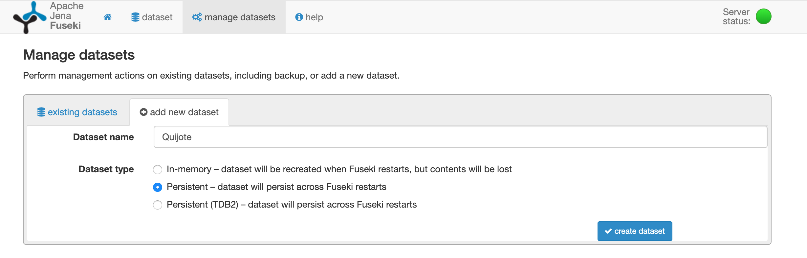
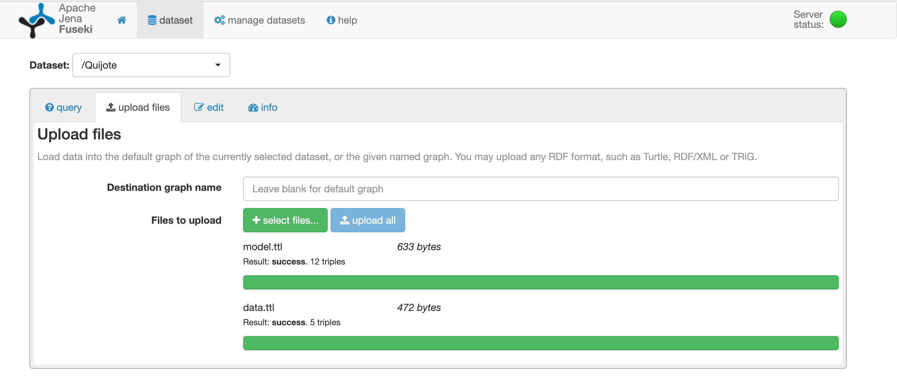

# OWL Reasoning in Apache Jena Fuseki

The main intention of the document is to make a tutorial of OWL reasoning in Apache Jena Fuseki. As a previous work performed, there has been several tutorials and documents that we used as a base: 

1. [Getting started with RDF SPARQL queries and inference using Apache Jena Fuseki](https://christinemdraper.wordpress.com/2017/04/09/getting-started-with-rdf-sparql-jena-fuseki/)
2. [Configuring Apache Jena Fuseki 2.4.1 inference and reasoning support using SPARQL 1.1: Jena inference rules, RDFS Entailment Regimes and OWL reasoning](https://github.com/jfmunozf/Jena-Fuseki-Reasoner-Inference/wiki/Configuring-Apache-Jena-Fuseki-2.4.1-inference-and-reasoning-support-using-SPARQL-1.1:-Jena-inference-rules,-RDFS-Entailment-Regimes-and-OWL-reasoning)
3. [Snippet about the configuration in Fuseki](https://gist.github.com/ruebot/fb7b1da82042860138d2d609756e07dc)

## 1. Setup Fuseki Server

The initial step is to configure Fuseki in our machine. For that purpose, we used [Docker](https://www.docker.com/). Our initial step is to define a docker-compose to deploy in our machine. For that, we need to create a document called "docker-compose.yml" in or root directory of the project: 

```
version: "3.5"
services:
    fuseki:
        image: stain/jena-fuseki
        container_name: st_fuseki
        restart: always
        ports:
            - "32768:3030"
        volumes:
            - "./volumes/fuseki_data:/fuseki"
        environment:
            ADMIN_PASSWORD: st_FuSeKi!
```

The code showed above describes the following aspects: 

* **"version"**: Determines the version of docker that in our case is "3.5". 
* **"services"**: Defines the different configurations (containers) that will compose our docker. In our case, we would like to include fuseki triplestore. 

Based on the fuseki configuration, we define the following aspects: 

* **"image"**: Represents the docker image to use. In our case, we would like to include a built docker image for Fuseki named as [stain/jena-fuseki](https://hub.docker.com/r/stain/jena-fuseki)
* **"container_name"**: Defines the name of our container. In this case, it could be any string we want. We used as a name "st_fuseki". 
* **"restart"**: It indicates the restart policy for the specified container. According to the [documentation](https://docs.docker.com/compose/compose-file/), when *"always"* is specified, the container always restarts. 
* **"ports"**: Indicates the match between the docker internal container port with the port where the docker is exposed. The initial value indicates the machine value and the second value indicates the docker port. In our case, the internal port of fuseki inside docker is "3030" and the accessible port from our machine will be the port "32768".
* **"volumes"**: Defines the data volumes that fuseki will use to store the persisted data. For our case, it is important in order to having control of the different configurations files as we will show in later points. In this regards, we matched the local "/volumes/fuseki_data" folder with the docker fuseki folder named as "/fuseki" where fuseki stores the different databases.
* **"environments"**: Defines the environment variables for the docker file. The only variable required for running fuseki is the admin password. 

Once built the docker-compose file, the next step is to build the docker-compose. For that, we created a file named as "docker-build.sh" that includes: 

```
#!/usr/bin/env bash
docker-compose -p dev -f docker-compose.yml build
```

Moreover, we also create the "docker-start.sh" (for starting the docker): 

```
#!/usr/bin/env bash
docker-compose -p dev -f docker-compose.yml up -d
```

The "docker-stop.sh" for stopping the docker: 

```
#!/usr/bin/env bash
docker-compose -p dev -f docker-compose.yml down
```

And the "docker-log.sh" for logging the "st-fuseki" container: 

```
#!/usr/bin/env bash
docker container logs -f st_fuseki
```

With all of these commands we could manage our fuseki triplestore docker. 

## 2. Dataset Configuration

Once we have tested the docker works perfectly. That means, we can access to the [Fuseki Instance](http://localhost:32768), we can proceed with the configuration of the dataset inside Fuseki. 

To elaborate the configuration of the dataset, it is important to be friendly with TTL notation and also, take a look to the [Apache Jena Assembler Quickstart](https://jena.apache.org/documentation/assembler/) and the [Apache Jena Assembler howto](https://jena.apache.org/documentation/assembler/assembler-howto.html). Considering this information combined with the references depicted at the beginning of the document, we need to create our data store inside the fuseki folder named as "configuration". In order words: 

Our first step here is to access [Fuseki Instance](http://localhost:32768) and create a dataset. For that, we need to click on "Manage datasets" and then "add new dataset": 




After that, we need to upload the corresponding data to the datset in order to avoid database corruption once we modify the configuration file. The data we will upload is the following: 

- In the default graph we will upload the data: "example1/ex1_data.ttl".
- In the "model" graph we will upload the ontology schema: "example1/ex1_model.ttl". 



Once the repository is created and the data uploaded, we can notice that Fuseki creates a configuration file with same name as the repository: 

```
@prefix :      <http://base/#> .
@prefix tdb:   <http://jena.hpl.hp.com/2008/tdb#> .
@prefix rdf:   <http://www.w3.org/1999/02/22-rdf-syntax-ns#> .
@prefix ja:    <http://jena.hpl.hp.com/2005/11/Assembler#> .
@prefix rdfs:  <http://www.w3.org/2000/01/rdf-schema#> .
@prefix fuseki: <http://jena.apache.org/fuseki#> .

<http://jena.apache.org/2016/tdb#DatasetTDB>
        rdfs:subClassOf  ja:RDFDataset .

ja:DatasetTxnMem  rdfs:subClassOf  ja:RDFDataset .

tdb:DatasetTDB  rdfs:subClassOf  ja:RDFDataset .

tdb:GraphTDB  rdfs:subClassOf  ja:Model .

<http://jena.apache.org/2016/tdb#GraphTDB2>
        rdfs:subClassOf  ja:Model .

ja:MemoryDataset  rdfs:subClassOf  ja:RDFDataset .

ja:RDFDatasetZero  rdfs:subClassOf  ja:RDFDataset .

<http://jena.apache.org/text#TextDataset>
        rdfs:subClassOf  ja:RDFDataset .

:service_tdb_all  a                   fuseki:Service ;
        rdfs:label                    "TDB Quijote" ;
        fuseki:dataset                :tdb_dataset_readwrite ;
        fuseki:name                   "Quijote" ;
        fuseki:serviceQuery           "query" , "" , "sparql" ;
        fuseki:serviceReadGraphStore  "get" ;
        fuseki:serviceReadQuads       "" ;
        fuseki:serviceReadWriteGraphStore
                "data" ;
        fuseki:serviceReadWriteQuads  "" ;
        fuseki:serviceUpdate          "" , "update" ;
        fuseki:serviceUpload          "upload" .

:tdb_dataset_readwrite
        a             tdb:DatasetTDB ;
        tdb:location  "/fuseki/databases/Quijote" .

<http://jena.apache.org/2016/tdb#GraphTDB>
        rdfs:subClassOf  ja:Model .

ja:RDFDatasetOne  rdfs:subClassOf  ja:RDFDataset .

ja:RDFDatasetSink  rdfs:subClassOf  ja:RDFDataset .

<http://jena.apache.org/2016/tdb#DatasetTDB2>
        rdfs:subClassOf  ja:RDFDataset .
```

Let's explain the document by parts to try to understand it all together. 

```
@prefix :      <http://base/#> .
@prefix tdb:   <http://jena.hpl.hp.com/2008/tdb#> .
@prefix rdf:   <http://www.w3.org/1999/02/22-rdf-syntax-ns#> .
@prefix ja:    <http://jena.hpl.hp.com/2005/11/Assembler#> .
@prefix rdfs:  <http://www.w3.org/2000/01/rdf-schema#> .
@prefix fuseki: <http://jena.apache.org/fuseki#> .

<http://jena.apache.org/2016/tdb#DatasetTDB>
        rdfs:subClassOf  ja:RDFDataset .

ja:DatasetTxnMem  rdfs:subClassOf  ja:RDFDataset .

tdb:DatasetTDB  rdfs:subClassOf  ja:RDFDataset .

tdb:GraphTDB  rdfs:subClassOf  ja:Model .

<http://jena.apache.org/2016/tdb#GraphTDB2>
        rdfs:subClassOf  ja:Model .

ja:MemoryDataset  rdfs:subClassOf  ja:RDFDataset .

ja:RDFDatasetZero  rdfs:subClassOf  ja:RDFDataset .

<http://jena.apache.org/text#TextDataset>
        rdfs:subClassOf  ja:RDFDataset .
```

This part refers to definitions of the context and different datasets that will be used in the service definiton. Thsi part defines the structure of the models and also indicates the type of model we will use. 

```
:service_tdb_all  a                   fuseki:Service ;
        rdfs:label                    "TDB Quijote" ;
        fuseki:dataset                :tdb_dataset_readwrite ;
        fuseki:name                   "Quijote" ;
        fuseki:serviceQuery           "query" , "" , "sparql" ;
        fuseki:serviceReadGraphStore  "get" ;
        fuseki:serviceReadQuads       "" ;
        fuseki:serviceReadWriteGraphStore
                "data" ;
        fuseki:serviceReadWriteQuads  "" ;
        fuseki:serviceUpdate          "" , "update" ;
        fuseki:serviceUpload          "upload" .

:tdb_dataset_readwrite
        a             tdb:DatasetTDB ;
        tdb:location  "/fuseki/databases/Quijote" .
```

This part is the more interesting due to it defines the "Service" or the dataset itself. As can be read, this part of the code defines the name and label of the dataset, the type of queries to ver performed (queries and data update). This part defines also, the operations and query names to be used in the HTTP query service. The last part of the code indicates the location of the dataset inside fuseki. 

```

<http://jena.apache.org/2016/tdb#GraphTDB>
        rdfs:subClassOf  ja:Model .

ja:RDFDatasetOne  rdfs:subClassOf  ja:RDFDataset .

ja:RDFDatasetSink  rdfs:subClassOf  ja:RDFDataset .

<http://jena.apache.org/2016/tdb#DatasetTDB2>
        rdfs:subClassOf  ja:RDFDataset .
```
This final part of the code indicates the structure of the model and data inside the data-store. 

Based on this initial file, we will perform some slightly changes to determine inference model based on the data and also enable OWL reasoning. For that, we will change the "fuseki:dataset" in order to link it with a RDFDataset that stores the inferred dataset inside the defaultGraph. Subsequently, the inferred dataset will be a "InfModel" as a result of performing the OWL reasoning.

```
:service_tdb_all  a                   fuseki:Service ;
        rdfs:label                    "TDB Quijote" ;
        fuseki:dataset                :inferred_dataset ; 
        fuseki:name                   "Quijote" ;
        fuseki:serviceQuery           "query" , "" , "sparql" ;
        fuseki:serviceReadGraphStore  "get" ;
        fuseki:serviceReadQuads       "" ;
        fuseki:serviceReadWriteGraphStore
                "data" ;
        fuseki:serviceReadWriteQuads  "" ;
        fuseki:serviceUpdate          "" , "update" ;
        fuseki:serviceUpload          "upload" .

:inferred_dataset
         a   ja:RDFDataset ;
        ja:defaultGraph :inference_model .

:inference_model 
        a      ja:InfModel ;
        ja:baseModel    :tdb_graph ;
        ja:reasoner [
                ja:reasonerURL <http://jena.hpl.hp.com/2003/OWLFBRuleReasoner>
        ] .

:tdb_graph a tdb:GraphTDB ;
        tdb:dataset     :tdb_dataset_readwrite .

```
With this changes the final document is as follows: 

```
@prefix :      <http://base/#> .
@prefix tdb:   <http://jena.hpl.hp.com/2008/tdb#> .
@prefix rdf:   <http://www.w3.org/1999/02/22-rdf-syntax-ns#> .
@prefix ja:    <http://jena.hpl.hp.com/2005/11/Assembler#> .
@prefix rdfs:  <http://www.w3.org/2000/01/rdf-schema#> .
@prefix fuseki: <http://jena.apache.org/fuseki#> .

<http://jena.apache.org/2016/tdb#GraphTDB>
        rdfs:subClassOf  ja:Model .

:tdb_graph  a        tdb:GraphTDB ;
        tdb:dataset  :tdb_dataset_readwrite .

:inferred_dataset  a     ja:RDFDataset ;
        ja:defaultGraph  :inference_model .

ja:RDFDatasetSink  rdfs:subClassOf  ja:RDFDataset .

tdb:DatasetTDB  rdfs:subClassOf  ja:RDFDataset .

<http://jena.apache.org/2016/tdb#GraphTDB2>
        rdfs:subClassOf  ja:Model .

<http://jena.apache.org/text#TextDataset>
        rdfs:subClassOf  ja:RDFDataset .

ja:RDFDatasetZero  rdfs:subClassOf  ja:RDFDataset .

:service_tdb_all  a                   fuseki:Service ;
        rdfs:label                    "TDB Quijote" ;
        fuseki:dataset                :inferred_dataset ;
        fuseki:name                   "Quijote" ;
        fuseki:serviceQuery           "query" , "" , "sparql" ;
        fuseki:serviceReadGraphStore  "get" ;
        fuseki:serviceReadQuads       "" ;
        fuseki:serviceReadWriteGraphStore
                "data" ;
        fuseki:serviceReadWriteQuads  "" ;
        fuseki:serviceUpdate          "" , "update" ;
        fuseki:serviceUpload          "upload" .

<http://jena.apache.org/2016/tdb#DatasetTDB>
        rdfs:subClassOf  ja:RDFDataset .

tdb:GraphTDB  rdfs:subClassOf  ja:Model .

ja:DatasetTxnMem  rdfs:subClassOf  ja:RDFDataset .

<http://jena.apache.org/2016/tdb#DatasetTDB2>
        rdfs:subClassOf  ja:RDFDataset .

ja:RDFDatasetOne  rdfs:subClassOf  ja:RDFDataset .

:inference_model  a   ja:InfModel ;
        ja:baseModel  :tdb_graph ;
        ja:reasoner   [ ja:reasonerURL  <http://jena.hpl.hp.com/2003/OWLFBRuleReasoner> ] .

ja:MemoryDataset  rdfs:subClassOf  ja:RDFDataset .

:tdb_dataset_readwrite
        a                      tdb:DatasetTDB ;
        tdb:location           "/fuseki/databases/Quijote" ;
        tdb:unionDefaultGraph  true .
```

In order to testing it, we can perform the following query: 

```
PREFIX ns: <http://www.example.org/ns#>
PREFIX rdf: <http://www.w3.org/1999/02/22-rdf-syntax-ns#>
SELECT *
WHERE {
?s rdf:type ns:Person .
}
```
And the expected result should be: 

```
{
  "head": {
    "vars": [ "s" ]
  } ,
  "results": {
    "bindings": [
      {
        "s": { "type": "uri" , "value": "http://www.example.org/ns#Sancho" }
      } ,
      {
        "s": { "type": "uri" , "value": "http://www.example.org/ns#Don_Quijote" }
      } ,
      {
        "s": { "type": "uri" , "value": "http://www.example.org/ns#Dulcinea" }
      }
    ]
  }
}
```
## Error Solving

### Error: " Cannot run program "ps": error=2, No such file or directory"

This error is caused due to we don't have installed the "ps" command in the docker file. To enable it, we need to follow the steps describe below: 

1. With the docker image started, go to the docker bash with the following command: 
   ```
   $ docker exec -it example_fuseki bash
   ```
2. Once in the docker bash, we need to install the "ps" command as follows: 
   ```
   # apt-get update & apt-get install ps
   ```
3. After installing everything, we need to exit this bash:
   ```
   #exit
   ``` 
4. Then, we need to commit the changes into a new image, for that, we need to get the contained id of the docker image by typing:
   ```
   $ docker ps -a
   ``` 
5. Perform the commit by changing <Contained_ID> by the number acquired in previous step: 
   ```
   $docker commit <Contained_ID> stain/jena-fuseki-ps
   ```
6. Change the docker-compose.yml to link the newer image:
   ```
   ...
   fuseki:
        image: stain/jena-fuseki-ps 
   ```